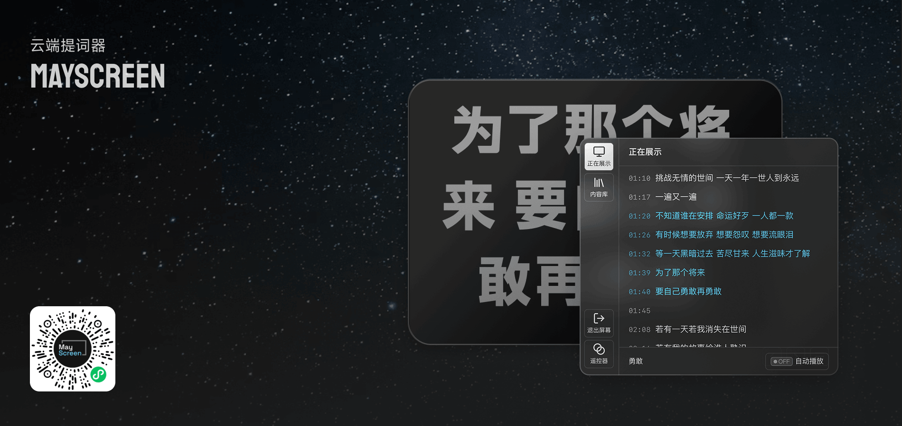

# MayScreen

MayScreen is a WeChat Mini Program teleprompter. It turns one phone into a landscape lyric screen and another nearby phone into a BLE remote control, so a performer or crew member can switch songs, move through lyrics, and keep playback state synchronized without a network connection between the two devices.

## Main Features

- **Screen mode**: displays lyrics in a fullscreen landscape view, keeps the device awake, and receives remote commands over BLE.
- **Remote mode**: provides a control panel for selecting songs, changing lyric lines, toggling autoplay, and controlling a nearby screen.
- **BLE device pairing**: the screen advertises itself as a MayScreen peripheral, while the remote scans, selects, connects, authorizes, and shows the connected screen state.
- **Short-session identity**: each screen and remote generates a short session nickname such as `S-1A2B` or `R-8F3A` for connection feedback.
- **Command protocol**: short BLE packets carry realtime commands, while large song or lyric payloads are compressed, chunked, transmitted, and reassembled.
- **Song library and search**: the control panel supports local song data and web lyric search through the MayScreen API.
- **Synchronized playback state**: the screen and remote share current song, lyric index, autoplay state, RSSI, and transfer progress through the app stores.

## Tech Stack

- **Mini Program runtime**: `weapp-vite` with the `wevu` runtime layer
- **State management**: Pinia-style stores from `wevu/store`
- **Styling**: Tailwind CSS v4 through `weapp-tailwindcss`, with scoped SCSS where needed
- **UI components**: TDesign Mini Program components, auto-imported by the TDesign resolver
- **BLE payload tools**: custom packet helpers with `pako` compression and text encoder/decoder polyfills

## BLE Model

MayScreen uses two BLE roles:

- **Screen** (`BleScreen`) opens the Bluetooth adapter in peripheral mode, creates a BLE peripheral server, advertises a MayScreen service UUID, receives commands, and publishes heartbeat/status notifications.
- **Remote** (`BleRemote`) opens the Bluetooth adapter in central mode, scans for advertised service UUIDs that start with `19970329-`, connects to a selected screen, subscribes to characteristics, and sends commands.

The protocol uses:

- `status` characteristic for heartbeat and liveness.
- `read` / `write` characteristics for short realtime command packets.
- `readLarge` / `writeLarge` characteristics for chunked song and lyric payloads.
- `Command.Authorize` and `Command.ReplyAuthorize` as the connection handshake before the UI enters the connected state.

## Development

Install dependencies:

```bash
bun install
```

Start the mini-program development build:

```bash
bun dev
```

Build for production:

```bash
bun build
```

Run static checks:

```bash
bun typecheck
bun lint
```

Open the project in WeChat DevTools:

```bash
bun open
```
